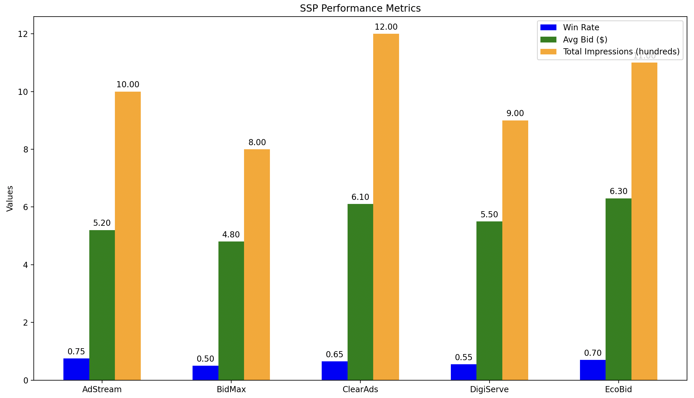

# SSP Metrics Visualization

## Overview

This repository contains a Python script for visualizing Supply-Side Platform (SSP) performance metrics. The script generates a multi-bar chart comparing key performance indicators across different SSPs using the `matplotlib` library.

## Features

- **SSP Performance Metrics**: Visualizes win rates, average bids, and total impressions for different SSPs.
- **Multi-Bar Chart**: Displays the metrics side-by-side for easy comparison.
- **Chart Image**: Includes a screenshot of the generated chart for reference.

## Files

- `ssp_performance_visualization.py`: Python script that generates the SSP performance metrics chart.
- `images/SSP_Metrics_Bar_Chart.png`: Screenshot of the bar chart produced by the script.

## Screenshot



## Requirements

- Python 3.x
- `matplotlib` library

## Installation

1. Clone this repository:
   ```bash
   git clone https://github.com/peterduhon/ssp-metrics-visualization.git
